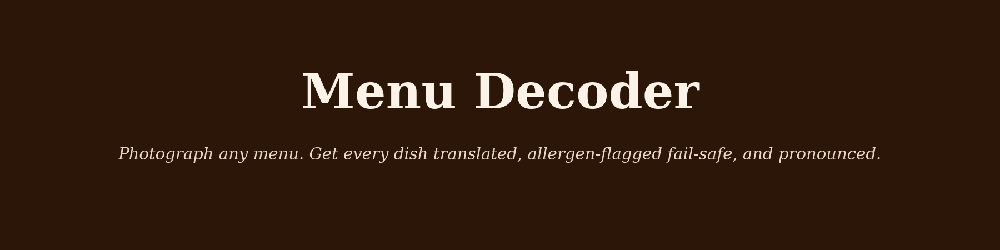
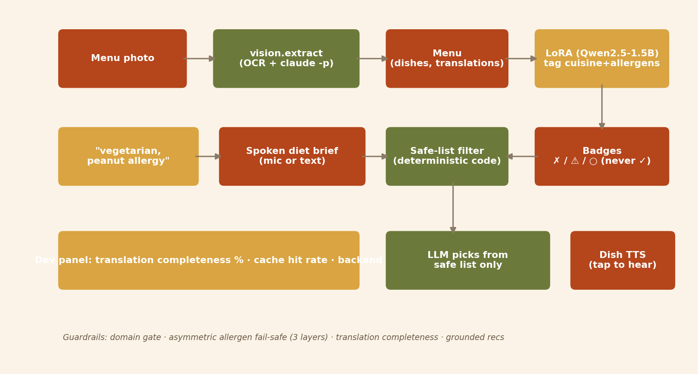

<p align="center">
  
</p>

# Menu Decoder

> 📖 **Product overview:** https://lyhjeremy.github.io/menu-decoder/overview/

Photograph any foreign-language menu, say your dietary constraints out
loud → every dish translated, allergen-flagged with a **deliberately
fail-safe design**, and pronounced — plus an honest "what I'd order for
you," picked only from a deterministically safe-listed candidate set.

## Why

Handing a chatbot a menu photo and a "no peanuts, vegetarian" request
means trusting it to both read every dish correctly *and* never quietly
clear an allergen it wasn't sure about. Menu Decoder is built around one
rule: **when the model is uncertain, the badge warns, never clears.**
There is no green checkmark for allergens anywhere in this app — an
uncertain dish always reads as `⚠ ask the staff`, never `✓`. Recommendations
are filtered to the safe list *in code*, before the model ever picks —
the LLM chooses among options that already passed the allergen/diet
filter, it cannot un-filter a dish by talking its way around it.

## How it works

<p align="center">
  
</p>

- **Vision extraction, one call per menu.** `vision.extract` reads the
  whole photographed menu into a structured `Menu` (language, sections,
  dishes with original text + translation + price), flagging any line it
  genuinely can't read as `unreadable=True` rather than silently dropping
  it — translation-completeness % is surfaced, not hidden.
- **Tagging: a locally fine-tuned dish tagger.** Each dish gets a
  `DishTags` call (cuisine, all 14 EU-allergen calls, spice, vegetarian/
  vegan) from a **Qwen2.5-1.5B model, LoRA fine-tuned on this laptop**
  (`app.py`'s `tag_dishes` calls the adapter directly via
  `mlx_lm.generate`; Gemini batched 10-per-call is the fallback path on a
  hosted Space, labeled honestly as such). This is a **generative
  structured-output fine-tune**, not a single-label classifier — the model
  learns to emit the full multi-field JSON tagging, not one token.
- **The allergen fail-safe — asymmetric by design, 3 enforced layers.**
  (1) The tagging rubric tells the model: if an allergen is *plausibly*
  present in a typical preparation, say `may`, not `not_indicated`. (2)
  Code-level rendering the model cannot override: `contains → ✗` ·
  `may → ⚠ ask the staff` · `not_indicated → ○ not indicated` — no green
  check, ever. (3) The recommendation candidate list is filtered
  **deterministically in code** before the LLM ever sees it — dishes with
  `contains`/`may` on any of the user's allergens (or `vegan/vegetarian =
  no` against a stated diet) are removed first; the model only picks
  among what's already safe.
- **Dish-name TTS.** Tap a dish, hear its *original*-language name via the
  toolkit's voice registry — unsupported locale hides the button instead
  of faking a pronunciation.
- **Token opt: translation/tag cache keyed `(original_text, language)`.**
  Menus repeat dishes heavily within themselves and popular dishes repeat
  *across* menus worldwide — the semantic cache is built to catch both.

## The fine-tune, honestly benchmarked

A dish name (+ optional description) goes in; the full `DishTags` JSON
comes out — cuisine, 14 allergen calls, spice, vegetarian/vegan. Trained
on **6,750 synthetic dish rows** (15 cuisines × 150 dishes × 3 prompt
variants — name-only, name+description, original-script+translation),
split **by dish family** so a dish's 3 variants never straddle
train/test (2,250 distinct dish families, zero leakage — see
[`eval/dataset_card.json`](eval/dataset_card.json)).

The metric that matters isn't top-1 accuracy — it's **allergen recall on
`contains`** (a missed allergen is dangerous) and the **false-safe rate**
(model says `not_indicated` when the true label is `contains`), reported
**per allergen**, not just averaged:

| System | N | Parse OK | Cuisine acc | Allergen recall (macro) | False-safe rate (macro) | Latency |
|---|---|---|---|---|---|---|
| Base Qwen2.5-1.5B (bare prompt) | 303 | 0.0% | 0.0% | 0.0% | 100.0% | 5.4s |
| **+ LoRA (this project)** | 303 | **100.0%** | **99.3%** | **69.3%** | **7.3%** | 6.7s |
| Claude teacher (bare prompt, same as LoRA sees) | 100 | 94.0% | 43.0% | 0.0% | 100.0% | 16.5s |
| Claude teacher (schema-primed) | 100 | 99.0% | 81.0% | 79.2% | 1.7% | 13.4s |

Claude appears **twice** on purpose. Given the exact same bare prompt the
LoRA model trained on (no schema described anywhere), Claude reasonably
answers a different question — "tell me about this dish" — and returns
valid JSON with its own field names instead of the tagging schema, which
is why its bare-prompt row reads near-zero *by construction*, not because
Claude doesn't know cuisines or allergens. Give it the exact output
contract (`src/decoder.py`'s own tagging rubric, no answer key) and it
jumps to 79.2% allergen recall / 1.7% false-safe. Read together, this is
the actual point of the fine-tune: **the LoRA model needs zero schema in
its prompt because the schema is baked into its weights; a zero-shot
system needs the full 14-allergen contract spelled out in every call just
to attempt the task at all** — a measured token-optimization result, not
just an accuracy number. Full per-allergen table (all 14 allergens, all 4
rows) in [`eval/benchmark.md`](eval/benchmark.md); visualization in
[`eval/allergen_recall_chart.png`](eval/allergen_recall_chart.png).
Methodology, the two real CLI bugs found while building this benchmark,
and the sanity checks run before trusting any of these numbers are in
[`writeup.md`](writeup.md).

**Known gap, reported not hidden:** the spec's mandatory **human slice**
(§5: ~60 dishes stratified across cuisines, Jeremy spot-checks the
labels) has not run yet — it requires Jeremy personally. Everything else
below is honest; this one slice is genuinely still open, not fabricated,
approximated, or quietly skipped.

## Guardrails

- **Domain gate** — a non-menu photo gets a refusal, not a hallucinated
  menu.
- **Allergen fail-safe** — asymmetric by design, 3 layers (rubric,
  rendering, deterministic filter), described above.
- **Translation completeness** — every detected dish line ends as either
  a translation or an explicit `⚠ couldn't read this line` flag, never
  silently dropped; completeness % shown in the dev panel.
- **Recommendation grounding** — picks are checked against real dish ids
  in code, not embedding similarity; the model can't invent a dish.
- **Confidence, not hidden** — per-dish extraction confidence rendered as
  opacity + tooltip.

## Files

| File | Purpose |
|---|---|
| `app.py` | Gradio app (photo → badged menu → safe picks → dish TTS) |
| `scripts/gen_dishes.py` | Overnight synthetic dish-tagging corpus generator |
| `training/prep_tagger.py` | Dish-family-split, leakage-checked tagger dataset |
| `training/bench_tagger.py` | 3-way honest benchmark (base/LoRA/Claude), per-allergen |
| `training/make_tagger_chart.py` | Per-allergen recall/false-safe bar chart |
| `src/decoder.py` | Tagging + recommendation prompt assembly |
| `src/safelist.py` | The allergen fail-safe: badge rendering + deterministic filter |
| `src/` | Vendored toolkit (llm, vision, guardrails, context, cache, audio) |
| `eval/` | Benchmark results, per-allergen chart, loss curve, dataset card |

## Running it

```bash
pip install -r requirements.txt
./setup_ocr.sh                          # tesseract + language packs (one-time)
python scripts/gen_dishes.py            # synthetic corpus (overnight, resumable)
python training/prep_tagger.py          # dish-family-split train/valid/test
bash training/lora_harness/train.sh mlx-community/Qwen2.5-1.5B-Instruct-4bit \
    data/lora training/adapters 4 12 800 1.5e-4 768
python training/bench_tagger.py         # 3-way benchmark -> eval/
python app.py
```

No API key required — everything runs locally except a `claude -p` call
for menu extraction (uses your Claude subscription, not a metered API).

## License

MIT — see [`LICENSE`](LICENSE).
