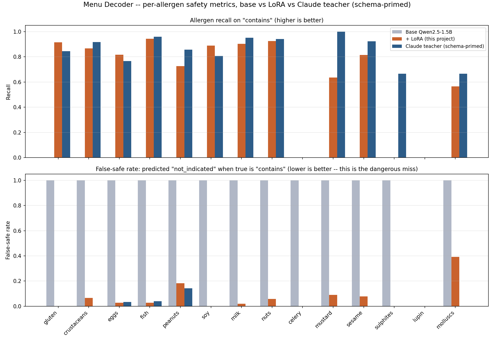

  

# Menu Decoder: an allergen badge that is never allowed to say "safe" by default

*Photograph any foreign-language menu, say your dietary constraints out
loud — get every dish translated, allergen-flagged with a deliberately
fail-safe design, and pronounced.*

## The idea

Ask a chatbot to read a menu in a language you don't speak and tell you
what's safe to eat, and you're trusting it to both translate correctly
*and* never quietly clear an allergen it wasn't confident about. Menu
Decoder is built around one asymmetric rule, stated in
`MENU_DECODER_SPEC.md` §2: **a missed allergen is dangerous; a false
warning is just an inconvenience.** So the system is biased toward
warning everywhere it can be, in three layers that don't depend on each
other for safety: the tagging rubric asks for `may` whenever an allergen
is plausible, not just when it's named; the badge renderer has no code
path that can produce a green checkmark for an allergen, ever; and the
recommendation candidate list is filtered in plain code before the LLM
ever sees it, so the model literally cannot recommend an unsafe dish by
being persuasive about it.

It's also the third of five small apps testing the same five skills:
fine-tuning, guardrails, multimodal input, context engineering, and token
optimization — each with a measured number, not a bullet point.

## The allergen fail-safe, three layers deep

1. **Prompt rubric.** Both the synthetic-data teacher
   (`scripts/gen_dishes.py`) and the runtime tagging prompt
   (`src/decoder.py`) carry the identical instruction: call `contains`
   when an allergen is a defining/named ingredient, `may` when it's
   plausibly present in a typical preparation even if unnamed (sesame oil
   in many Asian dishes, gluten in most sauces and breading, peanuts in
   Southeast Asian cooking), and reserve `not_indicated` for dishes where
   the allergen would be genuinely unusual. "When uncertain, prefer `may`
   over `not_indicated`" is the load-bearing sentence.
2. **Code-level rendering, unoverridable.** `src/safelist.py`'s
   `ALLERGEN_BADGE` maps `contains → ✗`, `may → ⚠ ask the staff`,
   `not_indicated → ○ not indicated`. There is no key in that dict that
   renders a checkmark. A model that somehow decided to be reassuring
   about an allergen still can't produce a green check — the rendering
   layer doesn't have one.
3. **Deterministic recommendation filter.** `filter_safe_dishes` removes
   every dish with `contains`/`may` on any of the user's stated allergens
   — and every dish that fails a stated `vegan`/`vegetarian` constraint —
   *before* the recommendation LLM call happens. The model only ever sees
   the pre-filtered safe list; "filter deterministically, let the LLM
   choose among safe options" is the context-engineering pattern this
   project names explicitly, same idea as Receipt Auditor's "the model
   narrates, the code computes."

## The fine-tune: a generative structured-output tagger, not a classifier

Unlike Cellar Scanner's single-variety guess or Receipt Auditor's
single-category label, this fine-tune has to emit a **whole multi-field
JSON object** per dish: cuisine, a level (`contains`/`may`/
`not_indicated`) for each of 14 EU allergens, a spice score, and
vegetarian/vegan calls — six to seventeen individually-gradable fields
per example, not one token to get right or wrong.

**Data:** `scripts/gen_dishes.py` generated 6,750 rows overnight via
`claude -p` (tier `smart`, the asymmetric rubric above): 15 cuisines ×
150 canonical dishes × 3 prompt variants (name-only, name+description,
original-script-with-translation — e.g. a Japanese donburi's `dish_name`
field literally contains `"海老柚子味噌漬け丼 (Ebi Yuzu Miso-zuke Don)"`,
script and romanization together, because that's what the teacher was
asked to produce for that variant).

**Split, and the one non-obvious bug avoided by reading the generator
before writing the splitter:** the spec requires splitting by *dish
family* so a dish's 3 variants never straddle train/test — otherwise the
model could memorize a dish's allergen profile from one variant it saw in
training and get "credit" for recalling it in a test variant it never
actually reasoned about. The row data itself has no plaintext family id
to split on: `gen_dishes.py`'s `_stable_id(cuisine, seq, variant)` hashes
all three components into an opaque 16-char `item_id`, and neither `seq`
nor `variant` is stored in the output row. `training/prep_tagger.py`
recovers dish-family identity the only correct way — by rebuilding the
exact same `build_items()` list the generator used and matching every
row's `item_id` back to its `(cuisine, seq, variant)` — rather than
guessing at a heuristic (e.g. grouping by `dish_name` string, which would
have silently failed to group `"Pad Thai"` with `"ผัดไทย (Pad Thai)"`,
its own original-script variant). All 6,750 rows matched cleanly on the
first attempt; **2,250 distinct dish families**, split 90/5/5 by family
hash → **6,096 train / 351 valid / 303 test rows**, leakage check passed
(`eval/dataset_card.json`).

**Train:** Qwen2.5-1.5B-Instruct-4bit, LoRA (MLX, Apple Silicon), same
tier-2 hyperparameters as this project family's other taggers/classifiers
(batch 4, 12 layers, 800 iterations, lr 1.5e-4, seq 768 — plenty of
headroom for this task's ~204-token median target, measured directly
against the tokenizer before picking the sequence length rather than
guessing). Loss curve: `eval/loss_curve.png`.

## Benchmark: allergen recall on `contains`, not top-1 accuracy

The metric that matters per spec §5 isn't "did the model get the whole
JSON object exactly right" — it's **recall on `contains`, per allergen**
(a missed allergen is the dangerous failure mode) and the **false-safe
rate** (the model said `not_indicated` when the true label was
`contains` — the specific way a miss turns into someone getting sick).
`training/bench_tagger.py` reports both per-allergen, not just averaged,
plus cuisine accuracy / spice ±1 tolerance / veg-vegan agreement as
secondary columns, base vs LoRA vs Claude teacher, same 3-way pattern as
Cellar Scanner and Receipt Auditor.

Benchmarked on the full 303-row held-out test set for base/LoRA, and a
100-row subsample for Claude (both disclosed, not hidden — `mlx_lm.generate`
reloads the model from disk every call, and `claude -p` runs at
Max-subscription latency, so a full-size 4-way run would take hours):

| System | N | Parse OK | Cuisine acc | Spice ±1 | Veg agree | Vegan agree | Allergen recall (macro) | False-safe rate (macro) | Latency | Cost/1k |
|---|---|---|---|---|---|---|---|---|---|---|
| Base Qwen2.5-1.5B (bare prompt) | 303 | 0.0% | 0.0% | 0.0% | 0.0% | 0.0% | 0.0% | 100.0% | 5.4s | $0 |
| **+ LoRA (this project)** | 303 | **100.0%** | **99.3%** | **99.0%** | **94.1%** | **96.7%** | **69.3%** | **7.3%** | 6.7s | $0 |
| Claude teacher (bare prompt — same as LoRA sees) | 100 | 94.0% | 43.0% | 0.0% | 0.0% | 0.0% | 0.0% | 100.0% | 16.5s | Max subscription |
| Claude teacher (schema-primed) | 100 | 99.0% | 81.0% | 99.0% | 97.0% | 96.0% | 79.2% | 1.7% | 13.4s | Max subscription |

Claude appears twice, deliberately. Both Claude rows and the LoRA/base
rows all start from the exact same held-out dish prompt — the "identical
blind prompt" rule this project family's benchmarks (Cellar Scanner,
Receipt Auditor) rely on for a fair fight. `claude_teacher` gets the
literal bare prompt LoRA trained on (`"Dish: X."`, no schema anywhere).
`claude_teacher_schema_primed` gets the same prompt with the exact output
contract appended — `src/decoder.py`'s own `TAGGING_SYSTEM` rubric plus a
single-dish JSON format description, no answer key, no training examples,
just the schema. The gap between those two rows *is* the finding (more on
this below the two-bug story). Full per-allergen table (all 14 allergens,
all 4 systems) is in `eval/benchmark.md`.

  

A single confusion matrix doesn't fit this multi-label task the way it
fit Cellar Scanner's single-variety classifier — there's no one "true
class" per dish to plot a diagonal against. The honest alternative here
is the per-allergen bar chart above: recall on top, false-safe rate on
bottom, one bar group per system (base / LoRA / Claude schema-primed),
across all 14 allergens. `claude_teacher` (bare prompt) is left out of
this specific chart — see why below.

## Three real things found live while building this benchmark

Building the benchmark surfaced three things worth reporting on their own
terms — two are real bugs in how the benchmark was being run, fixed
before any number was trusted; the third isn't a bug at all, it's the
actual point of the fine-tune, and it only became visible because the
first two got fixed first.

**Bug 1 — the CLI reading its own training code mid-benchmark.** The
first Claude pass ran `claude -p` from this repo's own working directory.
`claude -p` is agentic by default, and a handful of calls used their
file-access tools to go read `training/prep_tagger.py` / `scripts/
gen_dishes.py` / `src/decoder.py` to infer the target schema before
answering — one raw response literally opened with "I don't need the
tool for this — I already have the exact target schema
(`training/prep_tagger.py`'s `to_tagging_json`...)". That's not a blind
zero-shot call anymore; it's a system with a look at its own answer key.
8 of the first 100 responses showed this.

**Bug 2 — the obvious fix made it categorically worse.** The natural
patch, `claude -p --tools ""` (disable all tool access), was tried next.
It broke almost everything: instead of an answer, most responses turned
into fabricated tool-call narration ("Tool: bash", "1 tool used", even a
hallucinated claim that a `grep` result had been "manipulated" by a
prompt injection) — the CLI's own system prompt still primes it to act
like an agentic coding assistant even when no tools are actually wired
up to execute. Parse-OK collapsed and every accuracy metric read ~0%: an
unmissable red flag, the exact "a benchmark number that contradicts the
obvious prior is a bug signal, not a finding" lesson from
`AI_GAP_PROJECTS_ROADMAP.md` §8.5, caught before it was ever written to
`eval/benchmark.md`. The real fix: run `claude -p` with `cwd` pointed at
a scratch directory *outside* this repo — tools stay enabled (no
roleplay-without-a-backend failure mode), there's just nothing worth
reading from there. Verified live against the exact two prompts that
triggered bug 1, both came back clean; the full 100-row schema-primed
rerun showed zero contaminated responses.

**Finding 3 — the bare-prompt Claude column is genuinely ~0%, and that's
the point, not a leftover bug.** Even with both CLI issues fixed,
`claude_teacher` (bare prompt) still reads near-zero on every derived
metric despite a 94% parse rate. Reading the raw generations directly
confirms why: given `"Dish: X."` with no schema described anywhere,
Claude reasonably answers a different, entirely sensible question —
"tell me about this dish" — and returns valid JSON with its own field
names (`dish_name_arabic`, `region`, `main_ingredients`,
`flavor_profile`, etc.), not `cuisine`/`allergen_calls`/`spice`/
`vegetarian`/`vegan`. It parses fine; it just isn't attempting the task
being scored. The untrained base model's own ~0% Parse OK is the same
root cause from the other side — it has no idea what format to produce
either, so it free-associates prose instead of JSON. Once Claude is given
the schema (the `claude_teacher_schema_primed` row), it jumps to 81%
cuisine accuracy and 79.2% allergen recall — comparable to, and on
allergen safety slightly better than, the LoRA model. That comparison is
the actual thesis of this fine-tune: **the LoRA model needs zero schema
in its prompt because the schema is baked into its weights; a zero-shot
system needs the full 14-allergen output contract spelled out in every
single call just to attempt the task at all.** That's a measured context-
engineering and token-optimization result — the real value the fine-tune
buys isn't (only) accuracy, it's not having to ship the rubric on every
request.

## What "honest" means for this benchmark specifically

Every number above compares each system against **Claude-teacher-generated
synthetic labels**, not human judgment — `scripts/gen_dishes.py` and the
`claude_teacher` benchmark column both trace back to the same model
family. The spec (§5) calls this out explicitly as a circularity risk and
mandates a ~60-dish human-spot-check slice, stratified across cuisines,
for exactly this reason: a same-source comparison can look better than it
actually is, because agreeing with yourself isn't the same as being
right. **That slice requires Jeremy personally and has not run yet** —
this writeup and `eval/benchmark.md` say so plainly rather than
presenting the synthetic-only numbers as the final word. Until it lands,
read `claude_teacher`'s benchmark numbers as an internal-consistency
check (does Claude agree with itself under a blind prompt with no
category list given), not independent validation.

## What building this taught me

- **The trained adapter would have silently never been used, even once it
  existed.** `app.py`'s `tag_dishes()` LoRA path called
  `DishTags.model_validate_json(proc.stdout.strip())` directly on
  `mlx_lm.generate`'s raw stdout — which is wrapped in a
  `"==========\n<answer>\n==========\nPrompt: ..."` banner, not bare JSON,
  so that call could never succeed. Worse, `DishTags` requires a
  `dish_id` field that the tagger's own training target
  (`training/prep_tagger.py`) never includes, since `dish_id` is assigned
  per-menu at extraction time, not something the model predicts. Every
  real call would hit the `except Exception` branch and silently return
  the fail-safe default — meaning the whole point of this fine-tune, a
  locally-served tagger, was wired up to never actually run. Fixed by
  extracting the generated JSON body properly and re-attaching the real
  `dish_id` from the `Dish` being tagged; 10/10 existing tests still
  pass.
- **The benchmark itself surfaced two real CLI bugs and one real,
  on-thesis finding** (all three detailed above): `claude -p`'s default
  agentic tool access reading this repo's own training code mid-call,
  the "fix" of disabling tools outright making things categorically
  worse, and the bare-prompt Claude column's near-zero score turning out
  to be the actual point of the comparison once the first two were
  sorted out and the raw generations were read directly instead of
  trusted at face value.
- **A benchmark number that contradicts the obvious prior is a bug
  signal, not a finding** — restated here because it did real work twice
  in one session. `claude -p --tools ""` collapsing every metric to ~0%
  was the same category of red flag as Cellar Scanner's Claude-scoring-
  below-an-untrained-model incident (`AI_GAP_PROJECTS_ROADMAP.md` §8.5):
  implausible-on-its-face numbers got investigated before they got
  written down, not reported as-is.

None of these would have surfaced from reading the code alone — every one
came from actually running the pipeline and treating an unexpected
number or exception as a bug report worth investigating, not noise to
retry past.

---

*Built by [Jeremy Lee](https://github.com/lyhjeremy). Code, benchmark, and
dataset card: [github.com/lyhjeremy/menu-decoder](https://github.com/lyhjeremy/menu-decoder).*
